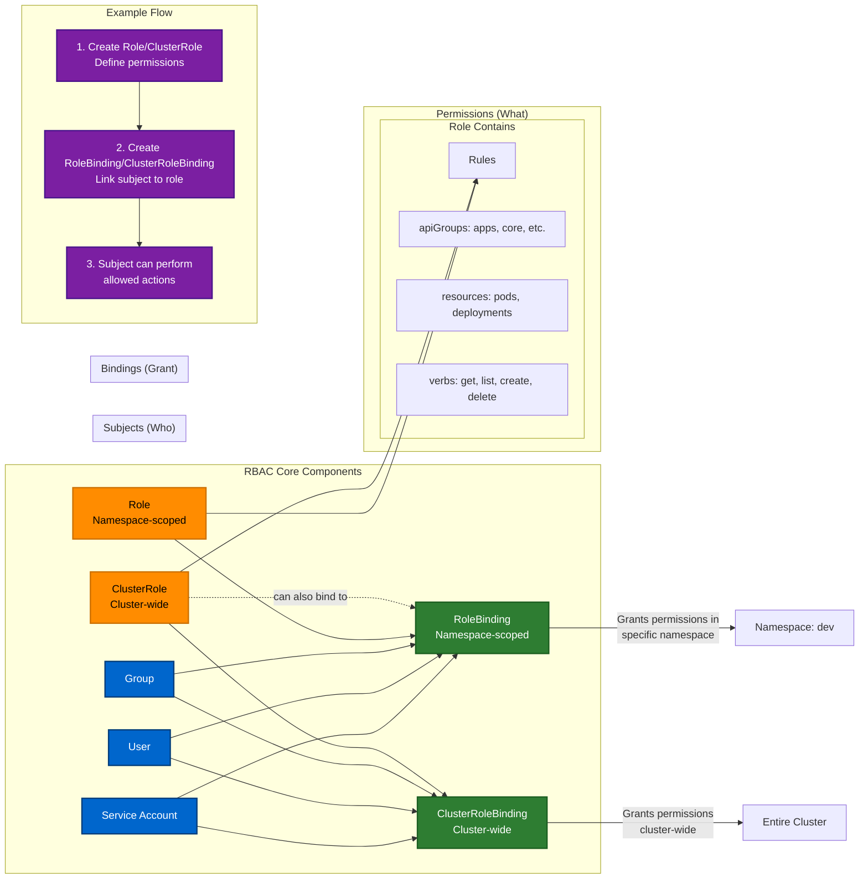

```mermaid
graph LR
    subgraph "RBAC Core Components"
        SA[Service Account]
        User[User]
        Group[Group]
        
        Role[Role<br/>Namespace-scoped]
        ClusterRole[ClusterRole<br/>Cluster-wide]
        
        RoleBinding[RoleBinding<br/>Namespace-scoped]
        ClusterRoleBinding[ClusterRoleBinding<br/>Cluster-wide]
    end
    
    subgraph "Subjects (Who)"
        SA
        User
        Group
    end
    
    subgraph "Permissions (What)"
        Role
        ClusterRole
        
        subgraph "Role Contains"
            R1[Rules]
            R2[apiGroups: apps, core, etc.]
            R3[resources: pods, deployments]
            R4[verbs: get, list, create, delete]
        end
    end
    
    subgraph "Bindings (Grant)"
        RoleBinding
        ClusterRoleBinding
    end
    
    subgraph "Example Flow"
        E1[1. Create Role/ClusterRole<br/>Define permissions]
        E2[2. Create RoleBinding/ClusterRoleBinding<br/>Link subject to role]
        E3[3. Subject can perform<br/>allowed actions]
        
        E1 --> E2
        E2 --> E3
    end
    
    SA --> RoleBinding
    User --> RoleBinding
    Group --> RoleBinding
    
    SA --> ClusterRoleBinding
    User --> ClusterRoleBinding
    Group --> ClusterRoleBinding
    
    Role --> RoleBinding
    ClusterRole --> ClusterRoleBinding
    ClusterRole -.can also bind to  .-> RoleBinding
    
    Role --> R1
    ClusterRole --> R1
    
    RoleBinding --> |Grants permissions in<br/>specific namespace| NS1[Namespace: dev]
    ClusterRoleBinding --> |Grants permissions<br/>cluster-wide| Cluster[Entire Cluster]
    
    style SA fill:#0066cc,stroke:#003d7a,stroke-width:2px,color:#fff
    style User fill:#0066cc,stroke:#003d7a,stroke-width:2px,color:#fff
    style Group fill:#0066cc,stroke:#003d7a,stroke-width:2px,color:#fff
    style Role fill:#ff8c00,stroke:#cc7000,stroke-width:2px,color:#000
    style ClusterRole fill:#ff8c00,stroke:#cc7000,stroke-width:2px,color:#000
    style RoleBinding fill:#2e7d32,stroke:#1b5e20,stroke-width:2px,color:#fff
    style ClusterRoleBinding fill:#2e7d32,stroke:#1b5e20,stroke-width:2px,color:#fff
    style E1 fill:#7b1fa2,stroke:#4a148c,stroke-width:2px,color:#fff
    style E2 fill:#7b1fa2,stroke:#4a148c,stroke-width:2px,color:#fff
    style E3 fill:#7b1fa2,stroke:#4a148c,stroke-width:2px,color:#fff
```